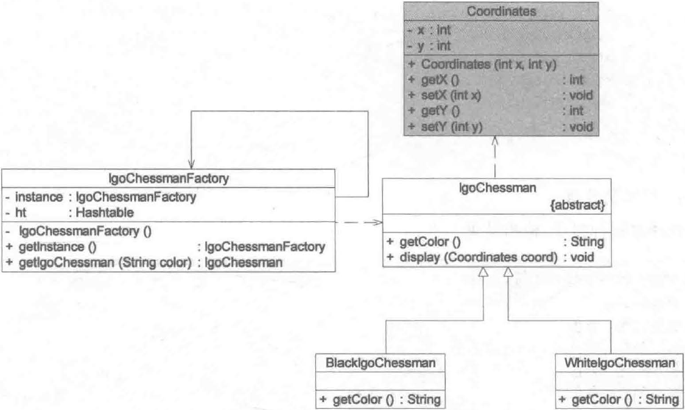
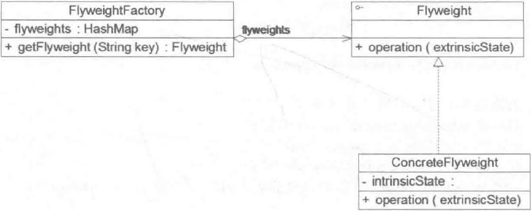
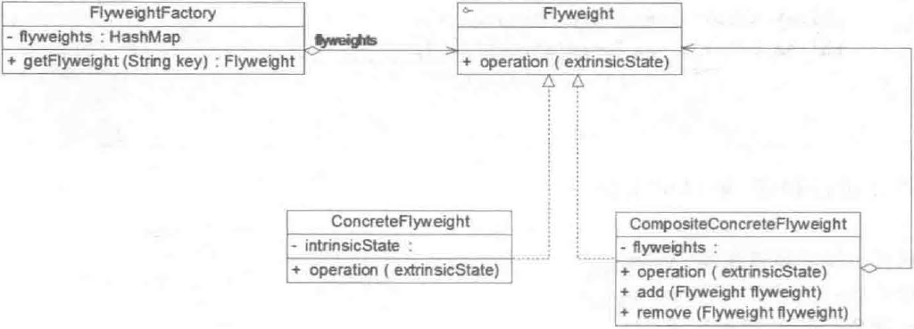

Java 中字符串的使用非常普遍，如果每个字符串都用一个对象来表示，会导致系统中有很多重复的字符串，占用较多的内存空间。那么如何避免系统中出现大量相同或相似的对象，同时又不影响客户端程序这些对象进行操作？享元模式正是为解决这一类问题而诞生。享元模式通过共享技术实现相同或相似对象的重用，在逻辑上每一个出现的字符都有一个对象与之对应，然而在物理上它们却共享同一个享元对象，这个对象可以出现在一个字符串的不同地方，相同的字符对象都指向同一个实例，在享元模式中存储这些共享实例对象的地方称为享元池 (Flyweight Pool) 。

享元对象能做到共享的关键是区分了内部状态 (Intrinsic State) 和外部状态 (Extrinsic State) 。下面将对享元的内部状态和外部状态进行简单的介绍。

（1）内部状态是存储在享元对象内部并且不会随环境改变而改变的状态，内部状态可以共享。例如字符的内容不会随外部环境的变化而变化，无论在任何环境下字符 “a“ 始终是 “a“ ，都不会变成 “b“ 。

（2）外部状态是随环境改变而改变的、不可以共享的状态。享元对象的外部状态通常由客户端保存，并在享元对象被创建之后需要使用的时候再传入到享元对象内部。一个外部状态与另一个外部状态之间是相互独立的。例如字符的颜色和大小是两个独立的外部状态，它们可以独立变化，相互之间没有影响。

正因为区分了内部状态和外部状态，可以将具有相同内部状态的对象存储在享元池中，享元池中的对象是可以实现共享的，当需要的时候就将对象从享元池中取出，实现对象的复用。通过向取出的对象注入不同的外部状态可以得到一系列相似的对象，而这些对象在内存中实际上只存储一份。

> Flyweight Pattern: Use sharing to support large numbers of fine-grained objects efficiently.
> 
> 享元模式：运用共享技术有效地支持大量细粒度对象的复用。

享元模式是一种对象结构型模式，又称为轻量级模式，它要求能够被共享的对象必须是细粒度对象。

## 结构

享元模式的结构较为复杂，通常结合工厂模式一起使用。它包含了一个享元工厂类。

享元模式包含以下 4 个角色：

（1）**Flyweight**（**抽象享元类**）：抽象享元类通常是一个接口或抽象类，在抽象享元类中声明了具体享元类公共的方法，这些方法可以向外界提供享元对象的内部数据（内部状态），同时也可以通过这些方法来设置外部数据（外部状态）。

（2）**ConcreteFlyweight**（**具体享元类**）：具体享元类实现了抽象享元类，其实例称为享元对象；在具体享元类中为内部状态提供了存储空间。通常可以结合单例模式来设计具体享元类为每一个具体享元类提供唯一的享元对象。

（3）**UnsharedConcreteFlyweight**（**非共享具体享元类**）：并不是所有的抽象享元类的子类都需要被共享，不能被共享的子类可设计为非共享具体享元类；当需要一个非共享具体亨元类的对象时可以直接通过实例化创建。

（4）**FlyweightFactory**（**享元工厂类**）：享元工厂类用于创建并管理享元对象，它针对抽象享元类编程，将各种类型的具体享元对象存储在一个享元池中，享元池一般设计为一个存储＂键值对＂的集合（也可以是其他类型的集合），可以结合工厂模式进行设计；当用户请求一个具体享元对象时．享元工厂提供一个存储在享元池中的实例或者创建一个新的实例（如果不存在），返回新创建的实例并将其存储在享元池中。

## 实现

抽象享元类：

```java
public abstract class Flyweight {
  public abstract void operation(String extrinsicState);
}
```

具体享元类：

```java
public class ConcreteFlyweight extends Flyweight {
  // 内部状态 intrinsicState 作为成员变量，同一个享元对象的内部状态是一致的
  private String intrinsicState;
  
  public ConcreteFlyweight(String intrinsicState) {
    this.intrinsicState = intrinsicState;
  }
  
  // 外部状态 extrinsicState 在使用时由外部设置，不保存在享元对象中
  // 即使是同一个对象，在每一次调用时也可以传入不同的外部状态
  public void operation(String extrinsicState) {
    // 业务方法
  }
}
```

非共享具体享元类

```java
public class UnsharedConcreteFlyweight extends Flyweight {
  public void operation(String extrinsicState) {
    // 业务方法
  }
}
```

享元工厂类

```java
public class FlyweightFactory {
  private Map<String, Flyweight> map = new HashMap<>();
  
  public Flyweight getFlyweight(String key) {
    if (map.containsKey(key)) {
      return map.get(key);
    } else {
      Flyweight fw = new ConcreteFlyweight()
      map.put(key, fw);
      return fw;
    }
  }
}
```

## 应用实例

某软件公司要开发一个围棋软件，在围棋棋盘中包含大量的黑子和白子，它们的形状、大小一模一样，只是出现的位置不同而已。如果将每一个棋子作为一个独立的对象存储在内存中，将导致该围棋软件在运行时所需的内存空间较大，那么如何降低运行代价、提高系统性能是需要解决的一个问题。为了解决该问题，现使用享元模式来设计该围棋软件的棋子对象。

该实例结构图如下：



lgoChessman 充当抽象享元类， BlacklgoChessman 和 WhitelgoChessman 充当具体享元类， IgoChessmanFactory 充当享元工厂类，Coordinate 为外部状态。

Coordinate：

```java
public class Coordinate {
    int x;
    int y;

    public Coordinate(int x, int y) {
        this.x = x;
        this.y = y;
    }
}
```

IgoChessman ：

```java
public abstract class IgoChessman {
  public abstract String getColor();
  public void display(Coordinate coordinate) {
    System.out.printf("%s棋子 (%d, %d)\n", getColor(), coordinate.x, coordinate.y);
  }
}
```

具体享元类：

```java
public class WhiteIgoChessman extends IgoChessman {
    public String getColor() {
        return "白色";
    }
}

public class BlackIgoChessman extends IgoChessman {
    public String getColor() {
        return "黑色";
    }
}
```

IgoChessmanFactory：

```java
public class IgoChessmanFactory {
  private static final IgoChessmanFactory instance = new IgoChessmanFactory();
  private final Map<String, IgoChessman> map;	// 享元池

  public IgoChessmanFactory() {
    map = new HashMap<>();
    map.put("w", new WhiteIgoChessman());
    map.put("b", new BlackIgoChessman());
  }

  // 返回享元工厂类的唯一实例
  public static IgoChessmanFactory getInstance() {
    return instance;
  }

  // 通过 key 获取具体享元对象
  public IgoChessman getIgoChessman(String color) {
    return map.get(color);
  }
}
```

客户端：

```java
public void test_IgoChessman() {
  IgoChessmanFactory factory = IgoChessmanFactory.getInstance();
  IgoChessman b1 = factory.getIgoChessman("b");
  IgoChessman b2 = factory.getIgoChessman("b");
  IgoChessman w1 = factory.getIgoChessman("w");
  b1.display(new Coordinate(2, 1));
  b2.display(new Coordinate(3, 5));
  w1.display(new Coordinate(3, 3));
  System.out.println("b1 == b2\t" + (b1 == b2));
}
```

输出结果：

```text
黑色棋子 (2, 1)
黑色棋子 (3, 5)
白色棋子 (3, 3)
b1 == b2	true
```

## 单纯享元模式

在单纯享元模式中所有的具体享元类都是可以共享的，不存在非共享具体享元类。其结构如图所示：



## 复合享元模式

将一些单纯享元对象使用组合模式加以组合还可以形成复合享元对象，这样的复合享元对象本身不能共享，但是它们可以分解成单纯享元对象，而后者则可以共享。其结构如图所示：



通过使用复合享元模式可以让复合享元类 CompositConcreteFlyweight 中所包含的每个单纯享元类ConcreteFlyweight 都具有相同的外部状态，而这些单纯享元的内部状态往往可以不同。如果希望为多个内部状态不同的享元对象设置相同的外部状态，可以考虑使用复合享元模式。

## 享元模式与 String 类

JDK 类库中的 String 类使用了享元模式。例如

```java
String a = "abc";
String b = "abc";
System.out.println(a == b);	// true
```

## 优缺点和适用环境

优点：

（1）享元模式可以减少内存中对象的数量，使得相同或者相似对象在内存中只保存一份，从而可以节约系统资源，提高系统性能。

（2）享元模式的外部状态相对独立，而且不会影响其内部状态，从而使享元对象可以在不同的环境中被共享。

缺点：

（1）享元模式使系统变得复杂，需要分离出内部状态和外部状态，这使得程序的逻辑复杂化。

（2）为了使对象可以共享，享元模式需要将享元对象的部分状态外部化，而读取外部状态将使运行时间变长。

适用环境：

（1）一个系统有大量相同或者相似的对象，造成内存的大量耗费。

（2）对象的大部分状态都可以外部化，可以将这些外部状态传入对象中。

（3）在使用享元模式时需要维护一个存储享元对象的享元池，而这需要耗费一定的系统资源，因此应当在需要多次重复使用享元对象时才使用享元模式。

## 参考

《Java 设计模式》．刘伟．清华大学出版社
