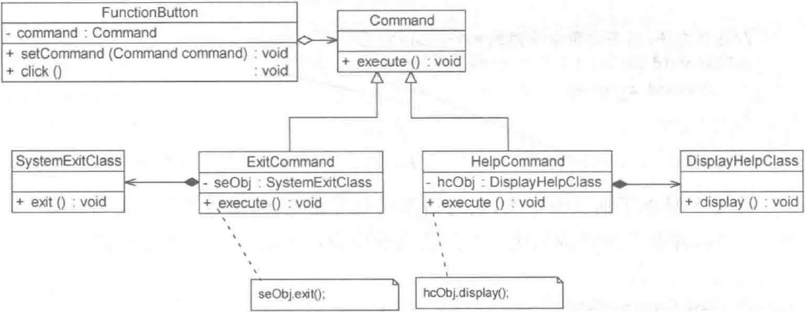

> Command Pattern: Encapsulate a request as an object, thereby letting you parameterize clients with different requests, queue or log requests, and support undoable operations.
>
> 命令模式：将一个请求封装为一个对象，从而可用不同的请求对客户进行参数化，对请求排队或者记录请求日志，以及支持可撤销的操作。

命令模式是一种对象行为型模式，其别名为动作 (Action) 模式或事务 (Transaction) 模式。命令模式可以将请求发送者和接收者完全解耦，发送者与接收者之间没有直接引用关系，发送请求的对象只需要知道如何发送请求，而不必知道如何完成请求。

## 结构

命令模式包含以下 4 个角色：

（1）**Command**（**抽象命令类**）：抽象命令类一般是一个抽象类或接口，在其中声明了用于执行请求的`execute()`等方法，通过这些方法可以调用请求接收者的相关操作。

（2）**ConcreteCommand**（**具体命令类**）：具体命令类是抽象命令类的子类，实现了在抽象命令类中声明的方法，它对应具体的接收者对象，将接收者对象的动作绑定其中。具体命令类在实现`execute()`方法时将调用接收者对象的相关操作 (Action) 。

（3）**Invoker**（**调用者**）：调用者即请求发送者，它通过命令对象来执行请求。一个调用者并不需要在设计时确定其接收者，因此它只与抽象命令类之间存在关联关系。在程序运行时可以将一个具体命令对象注入其中，再调用具体命令对象的`execute()`方法，从而实现间接调用请求接收者的相关操作。

（4）**Receiver**（**接收者**）：接收者执行与请求相关的操作，具体实现对请求的业务处理。

## 实现

```java
// 抽象命令类
public abstract class Command {
  public abstract void execute();
}

// 调用者
public class Invoker {
  private Command command;
  
  public Invoker(Conmmand command) {
    this.command = command;
  }
  
  // 业务方法，用于调用命令类的 execute() 方法
  public void call() {
    command.execute();
  }
}

// 具体命令类
public class ConcreteCommand extends Command {
  private Receiver r;		// 维持一个对请求接收者对象的引用
  
  public void execute() {
    r.action();		// 调用请求接收者的业务处理方法 action()
  }
}


// 接收者
public class Receiver {
  public void action() {
    // 具体操作
  }
}
```

## 应用实例

为了用户使用方便，某系统提供了一系列功能键，用户可以自定义功能键的功能，例如功能键FunctionButton 可以用于退出系统（由 SystemExitClass 类来实现），也可以用于显示帮助文档（由DisplayHelpClass 类来实现）。用户可以通过修改配置文件改变功能键的用途，现使用命令模式设计该系统，使得功能键类与功能类之间解耦，可为同一个功能键设置不同的功能。

实例结构图如下：



FunctionButton 充当请求调用者，SystemExitClass 和 DisplayHelpClass 充当请求接收者，Command 是抽象命令类， ExitCommand 和 HelpCommand 充当具体命令类。

```java
// 客户端代码
public class Client {
  public static void main(String args[]) {
    FunctionButton fb = new FunctionButton();
    Command command = (Command) XMLUtils.getBean();	// 读取配置文件，反射生成对象
    fb.setCommand(command);	// 将命令对象注入功能键
    fb.click();	// 调用功能键业务方法
  }
}
```

## 命令队列和宏命令

有时候，当一个请求发送者发送一个请求时有不止一个请求接收者产生响应，这些请求接收者将逐个执行业务方法，完成对请求的处理，此时可以通过命令队列来实现。

命令队列的实现方法有多种形式，最常用、灵活性最好的一种方式是增加一个 CommandQueue 类，由该类负责存储多个命令对象，而不同的命令对象可以对应不同的请求接收者。

```java
class CommandQueue {
  private Queue<Command> queue;

  CommandQueue() {
    queue = new LinkedList<>();
  }

  void addCommand(Command command) {
    queue.add(command);
  }

  void executeCommands() {
    while (!queue.isEmpty()) {
      Command command = queue.poll();
      command.execute();
    }
  }
}
```

宏命令 (Macro Command) 又称为组合命令 (Composite Command) ，它是组合模式和命令模式联用的产物。宏命令是一个具体命令类，它拥有一个集合，该集合包含对其他命令对象的引用。通常宏命令不直接与请求接收者交互，而是通过它的成员来调用接收者的方法。当调用宏命令的`execute()`方法时将递归调用它所包含的每个成员命令的`execute()`方法， 一个宏命令的成员可以是简单命令，也可以继续是宏命令。执行一个宏命令将触发多个具体命令的执行，从而实现对命令的批处理。

```java
class MacroCommand implements Command {
  private List<Command> commands;

  MacroCommand(List<Command> commands) {
    this.commands = commands;
  }

  @Override
  public void execute() {
    for (Command command : commands) {
      command.execute();
    }
  }
}
```

## 优缺点和适用环境

优点：

（1）降低系统耦合度。

（2）新的命令很容易加入到系统中。

（3）比较容易设计一个命令队列或宏命令

（4）为请求的撤销 (Undo) 和恢复 (Redo) 提供设计和实现方案

缺点：

容易导致系统有过多的命令类。

适用环境：

（1）系统需要将请求调用者和请求接收者解耦，使得调用者和接收者不直接交互。

（2）系统需要在不同的时间指定请求、将请求排队和执行请求。

（3）系统需要支持命令的撤销 (Undo) 操作和恢复 (Redo) 操作。

（4）系统需要将一组操作组合在一起形成宏命令。

## 参考

《Java 设计模式》．刘伟．清华大学出版社
