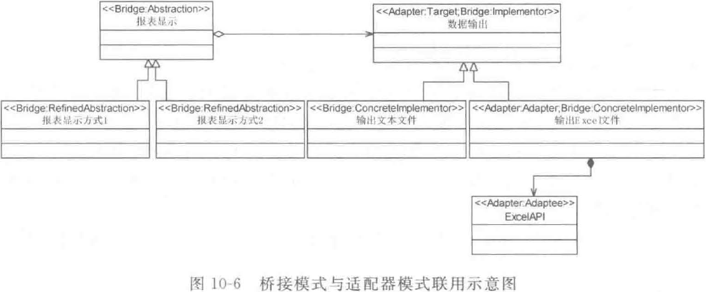

> Bridge Pattern: Decouple an abstraction from its implementation so that the two can vary independently.
> 
> 桥接模式：将抽象部分与它的实现部分解耦，使得两者都能够独立变化。

桥接模式是一种结构型设计模式，它将抽象与实现解耦，使得两者可以独立地变化。这种模式涉及到一个抽象类，它将实现类的对象作为一个成员变量，并通过构造函数或者 setter 方法将实现类的对象传递给抽象类。这样，抽象类可以在运行时调用实现类的方法，而不需要知道具体的实现细节。

## 结构

桥接模式包含以下 4 个角色：

（1）**Abstraction**（**抽象类**）：它是用于定义抽象类的接口，通常是抽象类而不是接口，其中定义了一个 Implementor（实现类接口）类型的对象并可以维护该对象，它与 Implementor 之间具有关联关系，它既可以包含抽象业务方法，也可以包含具体业务方法。

（2）**RefinedAbstraction**（**扩充抽象类**）：它扩充由 Abstraction 定义的接口，通常情况下它不再是抽象类而是具体类，实现了在 Abstraction 中声明的抽象业务方法，在 RefinedAbstraction 中可以调用在Implementor 中定义的业务方法。

（3）**Implementor**（**实现类接口**）：它是定义实现类的接口，这个接口可以和 Abstraction 的接口完全不同。一般而言， Implementor 接口仅提供基本操作，而 Abstraction 定义的接口可能会做更多更复杂的操作。Implementor 接口对这些基本操作进行了声明，而具体实现交给其子类。通过关联关系，在 Abstraction中不仅拥有自己的方法，还可以调用 Implementor 中定义的方法，使用关联关系来替代继承关系。

（4）**Concretelmplementor**（**具体实现类**）：它具体实现了 Implementor 接口，在不同的Concretelmplementor 中提供基本操作的不同实现，在程序运行时 Concretelmplementor 对象将替换其父类对象，提供给抽象类具体的业务操作方法。

## 实现

使用桥接模式时首先应该识别出一个类所具有的两个独立变化的维度，将它们设计为两个独立的继承等级结构，为两个维度都提供抽象层，并建立抽象耦合。

```java
public interface Implementor {
  public void operationImpl();
}

public class ConcreteImplementor implements Implementor {
  public void operationImpl() {
    //	具体业务方法实现
  }
}

public abstract class Abstraction {
  protected Implementor impl;		// 定义实现类接口对象
  
  public Abstraction(Implementor impl) {
    this.impl = impl;
  }
  
  public abstract void operation();		// 声明抽象业务方法
}

public class RefineAbstraction extends Abstraction {
  public void operation() {
    // 业务方法
    impl.operationImpl();
    // 业务方法
  }
}
```

桥接模式分为两个维度：Abstraction 和 Implementor，两者都是独立的继承体系，通过在 Abstraction 中注入 Implementor 对象的组合方式实现关联。Abstraction 的维度变化通过继承实现，而 Implementor 的维度变化通过接口实现。

## 桥接模式与适配器模式的联用

适配器模式通常用于现有系统与第三方产品功能的集成，采用增加适配器的方式将第三方类集成到系统中。桥接模式则不同，用户可以通过接口继承或类继承的方式对系统进行扩展。桥接模式和适配器模式用于设计的不同阶段，桥接模式用于系统的初步设计，对于存在两个独立变化维度的类可以将其分为抽象化和实现化两个角色，使它们可以分别进行变化；而在初步设计完成之后，当发现系统与已有类无法协同工作时可以采用适配器模式。

例如：在某系统的报表处理模块中需要将报表显示和数据输出分开，系统可以有多种报表显示方式也可以有多种数据输出方式，例如可以将数据输出为文本文件，也可以输出为 Excel文件。如果需要输出为 Excel 文件，则需要调用与 Excel 相关的 API，而这个 API 是现有系统所不具备的，该 API 由厂商提供。因此可以同时使用适配器模式和桥接模式来设计该模块、如图 10- 6 所示。



## 优缺点和适用环境

优点：

（1）分离抽象接口及其实现部分。桥接模式使用 “对象间的关联关系” 解耦了抽象和实现之间固有的绑定关系，使得抽象和实现可以沿着各自的维度来变化。

（2）很多情况下，桥接模式可以替代多层继承方案。

（3）桥接模式提高了系统的可扩展性，在两个变化维度中任意扩展一个维度都不需要修改原有系统，符合开闭原则。

缺点：

（1）桥接模式的使用会增加系统的理解与设计难度。

（2）桥接模式要求正确地识别出系统中的两个独立变化的维度， 因此其使用范围具有一定的局限性，如何正确识别两个独立维度也需要一定的经验积累。

适用环境：

（1）如果一个系统需要在抽象化和具体化之间增加更多的灵活性，避免在两个层次之间建立静态的继承关系， 通过桥接模式可以使它们在抽象层建立一个关联关系。

（2）一个类存在两个（或多个）独立变化的维度，且这两个（或多个） 维度都需要独立进行扩展。

（3）对于那些不希望使用继承或因为多层继承导致系统类的个数急剧增加的系统，桥接模式尤为适用。

## 参考

《Java 设计模式》．刘伟．清华大学出版社
