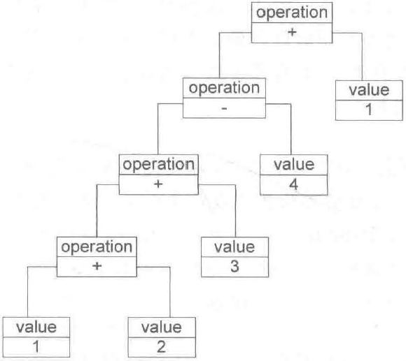
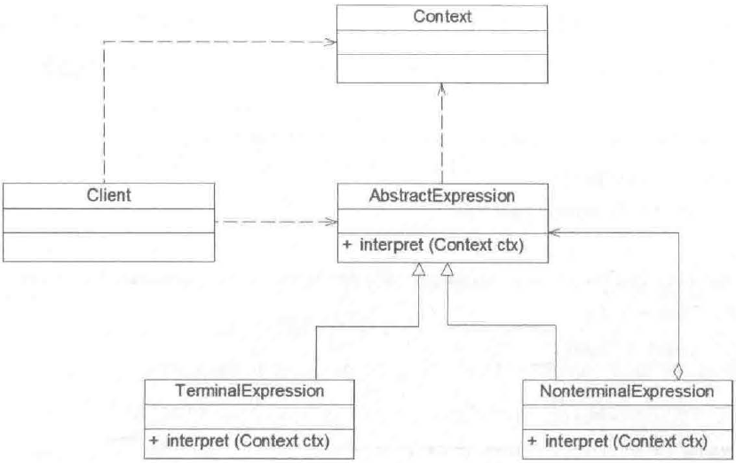
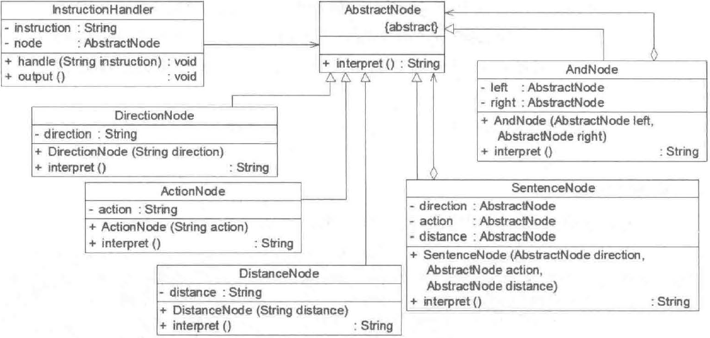

Interpreter Pattern: Given a language, define a representation for its grammar along with an interpreter that uses the representation to interpret sentences in the language.

解释器模式：给定一个语言，定义它的文法的一种表示，并定义一个解释器，这个解释器使用该表示来解释语言中的句子。

解释器模式是一种使用频率较低且学习难度较大的设计模式，它用于描述如何使用面向对象语言构成一个简单的语言解释器。在解释器模式的定义中所指的“语言”是使用规定格式和语法的代码，解释器模式是一种类行为型模式。

## 文法规则和抽象语法树

在分析解释器模式之前首先需要了解如何表示一个语言的文法规则以及如何构造一棵抽象语法树。以加/减法解释器为例，每个输入表达式（例如`1+2+3-4+1`）都包含了 3 个语言单位，可以使用以下文法规则定义：

```BNF
expression ::= value | operation
operation ::= expression '+' expression | expression '-' expression
value ::= an integer	// 一个整数值
```

该文法规则通过巴科斯范式（BNF）定义，::= 表示 “定义为”，| 表示 “或者”。

该文法规则包含三条语句，第一条是表达式的组成方式，其中 value 和 operation 是后面两个语言单位的定义，每一条语句所定义的字符串（如 value 和 operation）称为语言单位，其对应着终结表达式和非终结表达式。例如本例中的 operation 是非终结表达式，因为它的组成元素仍可以是表达式，而 value 是终结表达式，因为它的组成元素是最基本的语言单位，不可以再分解。

除了使用文法规则来定义一个语言外，还可以使用抽象语法树的图形方式来直观表示语言的构成。每一个抽象语法树都表示一个语言实例，例如语句 `1+2+3-4+1`可以表示为：



在抽象语法树中，终结表达式作为叶子结点，非终结表达式作为非叶子节点。

## 解释器模式结构

解释器模式结构与组合模式结构类似，其包含 4 个角色：

（1）**AbstractExpression（抽象表达式）**：在抽象表达式中声明了抽象的解释操作，它是所有终结符表达式和非终结符表达式的公共父类。

（2）**TerminalExpression（终结表达式）**：终结符表达式是抽象表达式的子类，它实现了与文法中的终结符相关联的解释操作，在句子中的每一个终结符都是该类的一个实例。通常在一个解释器模式中只有少数几个终结符表达式类，它们的实例可以通过非终结符表达式组成较为复杂的句子。

（3）**NonTerminalExpression（非终结表达式）**：非终结符表达式也是抽象表达式的子类，它实现了文法中非终结符的解释操作，由千在非终结符表达式中可以包含终结符表达式，也可以继续包含非终结符表达式，因此其解释操作一般通过递归的方式完成。

（4）**Context（环境类）**：环境类又称为上下文类，它用于存储解释器之外的一些全局信息，通常它临时存储了需要解释的语句。



## 解释器模式实现

在解释器模式中每一种终结符和非终结符都有一个具体类对应。

抽象表达式类实现如下：

```java
public abstract class AbstractExpression {
  public abstract void interpret(Context ctx);
}
```

终结符表达式类实现如下：

```java
public class TerminalExpression extends AbstractExpression {
  public void interpret(Context ctx) {
    // 终结符表达式的解释操作
  }
}
```

非终结符表达式类典型实现如下：

```java
public class NonterminalExpression extends AbstractExpression {
  public AbstractExpression left;
  public AbstractExpression right;
  
  public NonterminalExpression(AbstractExpression left, AbstractExpression right) {
    this.left = left;
    this.right = right;
  }
  
  public void interpret(Context ctx) {
    // 递归调用每一个组成部分的 interpret 方法
    // 在递归调用时指定组成部分的连接方式，即非终结符的功能
  }
}
```

环境类通常包含一个`HashMap`或`ArrayList`等类型的集合对象，存储一系列公共信息。

```java
public class Context {
  public Map<String, String> map = new HashMap<>();
  
  // 往环境类设值
  public void assign(String key, String val) {
    map.put(key, val);
  }
  
  // 获取环境类的值
  public void lookup(String key) {
    map.get(key);
  }
}
```

环境类还可以提供一些所有表达式解释器共有的功能。当系统无需提供全局公共信息时可以省略环境类。

## 应用实例

某软件公司要开发一套机器人控制程序，在该机器人控制程序中包含一些简单的英文控制指令，每一个指令对应一个表达式（expression），该表达式可以是简单表达式也可以是复合表达式，每一个简单表达式由移动方向（direction），移动方式（action）和移动距离（distance）3 部分组成，其中移动方向包括上（up）、下（down）、左（left）、右（right）；移动方式包括移动（move）和快速移动（run）；移动距离为一个正整数。两个表达式之间可以通过与（and）连接形成复合（composite）表达式。用户通过对图形化的设置界面进行操作可以创建一个机器人控制指令，机器人在收到指令后将按照指令的设置进行移动，例如输入控制指令 “up move 5"，则 “向上移动 5 个单位”；输入控制指令 “down run 10 and left move 20“，则 “向下快速移动 10 个单位再向左移动 20 个单位”。现使用解释器模式来设计该程序并模拟实现。

## 实现

使用 BNF 定义该语言的文法规则如下：

```BNF
expression ::= direction action distance | composite		// 表达式
composite ::= expression 'and' expression								// 复合表达式
direction ::= 'left' | 'right' | 'up' | 'down'					// 移动方向
actoin ::= 'move' | 'run'																// 移动方式
distance ::= an integer																	// 移动距离
```

机器人控制实例结构图如下所示：



（1）AbstractNode：抽象结点类，充当抽象表达式角色

```java
public abstract class AbstractNode {
  public abstract String interpret();
}
```

（2）AndNode：And 结点类，充当非终结表达式角色

```java
public class AndNode extends AbstractNode {
  public AbstractNode left;
  public AbstractNode right;
  
  public AndNode(AbstractNode left, AbstractNode right) {
    this.left = left;
    this.right = right;
  }
  
  public String interpret() {
    return this.left.interpret() + "再" + this.right.interpret();
  }
}
```

（3）SentenceNode：简单句子结点类，充当非终结表达式角色

```java
public class SentenceNode extends AbstractNode {
  public AbstractNode direction;
  public AbstractNode action;
  public AbstractNode distance;
  
  //省略全参构造函数
  ...
    
  public String interpret() {
    return direction.interpret() + action.interpret() + distance.interpret();
  }
}
```

（4）三个终结符表达式角色

```java 
// 方向结点类
public class Direction extends AbstractNode {
  public String direction;
  
  public Direction(String direction) {
    this.direction = direction;
  }
  
  public String interpret() {
    switch(direction.toLowerCase()) {
        case "up" -> { return "向上"; }
        case "down" -> { return "向下"; }
        case "left" -> { return "向左"; }
        case "right" -> { return "向右"; }
        default -> { return "无效指令"; }
    }
  }
}


// 行为结点类
public class Action extends AbstractNode {
  public String action;
  
  public Action(String action) {
    this.action = action;
  }
  
  public String interpret() {
    switch(action.toLowerCase()) {
        case "move" -> { return "移动"; }
        case "run" -> { return "快速移动"; }
        default -> { return "无效指令"; }
    }
  }
}

// 行为结点类
public class Distance extends AbstractNode {
  public String distance;
  
  public Distance(String distance) {
    this.distance = distance;
  }
  
  public String interpret() {
    return distance + "m";
  }
}
```

（4）InstructionHandler：指令处理类，工具类，提供相应的方法对输入指令进行处理。它将输入指令分割为字符串数组，将第一个、第二个和第三个单词组合成一个句子，并存入栈中；如果发现有单词 “and"，则将 “and” 后的第一个、第二个和第三个单词组合成一个新的句子作为 "and” 的右表达式，并从栈中取出原先所存的句子作为左表达式，然后组合成一个 And 结点存入栈中。依此类推，直到整个指令解析结束。

```java
public class InstructionHandler {
  private AbstractNode node;
  
  public void handle(String instruction) {
    AbstractNode left, right;
    AbstractNode direction, action, distance; 
    Stack<AbstractNode> stack = new Stack<>();		// 创建栈用于临时存放结点
    
    String[] words = instruction.split(" ");
    for (int i = 0; i < words.length; i++) {
      /* 遇到 and 则将之后三个单词作为三个终结符表达式连接成 SentenceNode，作为右表达式，栈顶元素作为左表达式，最后连接成 AndNode 并压入栈中 */
      if (words[i].equalsIgnoreCase("and")) {
        left = stack.pop();
        direction = new DirectionNode(words[++i]);
        action = new ActionNode(words[++i]);
        distance = new DistanceNode(words[++i]);
        right = new SentenceNode(direction, action, distance);
        stack.push(new AndNode(left, right));
      } else {
        /* 否则逐个解释连接成 SentenceNode */
        direction = new DirectionNode(words[i++]);
        action = new ActionNode(words[i++]);
        distance = new DistanceNode(words[i]);
        stack.push(new SentenceNode(direction, action, distance));
      }
    }
    
    this.node = stack.pop();	// 存储栈中的结点
  }
  
  public String output() {
    return this.node.interpret();
  }
}
```

（5）Client：客户端测试类

```java
public class Client {
  public static void main(String[] args) {
    String instruction = "down run 10 and left move 20";
    InstructionHandler handler = new InstructionHandler();
    handler.handle(instruction);
    System.out.println(handler.output());
  }
}
```

## 优缺点与适用环境

优点：

- 易于改变和扩展语法。解释器模式中可以通过类继承等机制扩展文法。

- 增加新的解释表达式比较方便。只需要对应增加一个新的终结符表达式类或非终结符表达式类即可。

缺点：

- 复杂文法难以维护。如果一个语言包含太多文法规则，类的个数会急剧增加，导致系统难以管理和维护。此时可以考虑使用语法分析程序取代解释器模式。

- 执行效率较低。解释器模式使用了大量的递归调用，在解释较复杂的句子时速度很慢。

适用环境：

- 可以将一个需要解释执行的语言中的句子表示为一棵抽象语法树。

- 语言文法较为简单。

- 执行效率不敏感。

## 参考

《Java 设计模式》．刘伟．清华大学出版社
