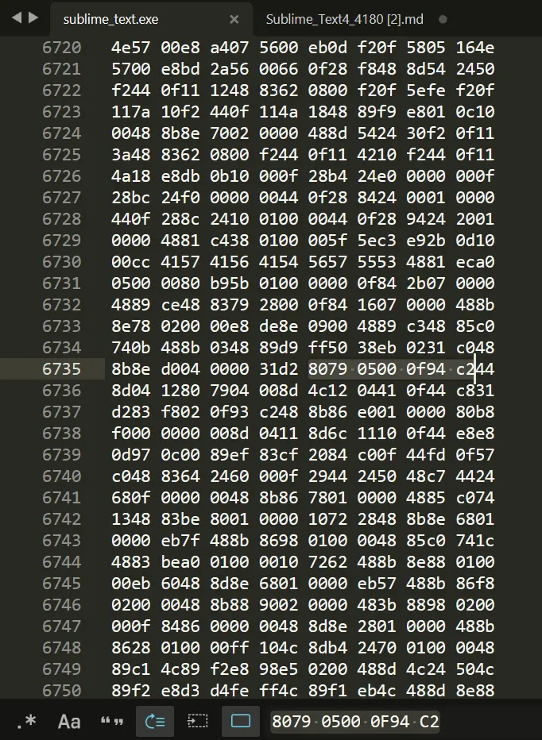

## 介绍

官网： [https://www.sublimetext.com](https://www.sublimetext.com/)

## 下载地址

https://download.sublimetext.com/sublime_text_build_4180_x64_setup.exe

## 激活

安装之后，使用sublime text 打开安装目录下的sublime_text.exe文件。

`Ctrl + F` 搜索

```text
8079 0500 0f94 c2
```

更改为

```text
c641 0501 b200 90
```



另存到其他路径，然后关闭 sublime text，替换原 sublime_text.exe 即可。

## 检查激活状态

点击菜单栏 Help - About Sublime Text 可检测激活状态。

## 软件安装中文语言包

1、点击菜单栏 Tools - Install Package Control 跳出弹框点击确定按钮

2、点击菜单栏 Preferences – Package Control

3、弹框中输入 Install package，选中 Package Control: Install Package 然后等待弹窗（可能需要耐心等待一段时间）

4、等出现如下弹窗后, 在弹窗的搜索框中输入 ChineseLocalizations，点击出现的选项

5、等待一段时间，如果出现了如下画面则汉化步骤全部完成

6、后续若需要更改，可点击菜单栏 帮助 - Language 选择进行更改。

## 声明

转载自 https://songxwn.com/Sublime_Text4_4180/
