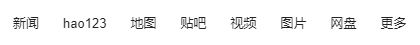

[`colly`](https://github.com/gocolly/colly) 是用 Go 语言编写的功能强大的爬虫框架。它提供简洁的 API，拥有强劲的性能，可以自动处理 cookie&session，还有提供灵活的扩展机制。

## 快速使用

安装 `colly` 库：

```go
$ go get -u github.com/gocolly/colly/v2
```

示例：爬取百度首页左上角链接

 

```go
import (
	"fmt"
	"github.com/gocolly/colly/v2"
	"testing"
)

func TestCrawl(t *testing.T) {
	c := colly.NewCollector(
		colly.AllowedDomains("www.baidu.com"),
	)

	c.OnHTML("#s-top-left a", func(e *colly.HTMLElement) {
		fmt.Println(e.Text)
	})

	c.Visit("https://www.baidu.com/")
}
```

`colly` 使用流程：

1. 调用 `colly.newCollector()` 创建一个类型为 `*colly.Collector` 的爬虫对象。由于每隔网页都有很多指向其它网页的链接。如果不加限制的话，运行可能永远不会停止。所以上面通过传入一个选项 `colly.AllowedDomains("www.baidu.com")` 限制只爬取域名为 `www.baidu.com` 的网页
2. 调用 `c.onHTML(goquerySelector string, f HTMLCallback)` 方法注册回调函数，第一个参数是类似 JQuery 的选择器，对于选择器匹配的每个元素都会执行函数 `f`。

3. 调用 `c.Visit()` 访问第一个页面

`colly` 爬取到页面之后，会使用 `goquery` 解析这个页面。然后查找注册的 HTML 回调对应元素选择器（element-selector），将 `goquery.Selection` 封装成一个 `colly.HTMLElement` 执行回调。

`colly.HTMLElement` 其实就是对 `goquery.Selection` 的简单封装：

```go
type HTMLElement struct {
	Name			string
	Text			string
	Request		*Request
	Response	*Response
	DOM				*goquery.Selection
	Index			int
}
```

## `HTMLElement` 方法

- `Attr(k string)`：返回当前元素的属性，上面示例中我们使用`e.Attr("href")`获取了`href`属性；
- `ChildAttr(goquerySelector, attrName string)`：返回`goquerySelector`选择的第一个子元素的`attrName`属性；
- `ChildAttrs(goquerySelector, attrName string)`：返回`goquerySelector`选择的所有子元素的`attrName`属性，以`[]string`返回；
- `ChildText(goquerySelector string)`：拼接`goquerySelector`选择的子元素的文本内容并返回；
- `ChildTexts(goquerySelector string)`：返回`goquerySelector`选择的子元素的文本内容组成的切片，以`[]string`返回。
- `ForEach(goquerySelector string, callback func(int, *HTMLElement))`：对每个`goquerySelector`选择的子元素执行回调`callback`；
- `Unmarshal(v interface{})`：通过给结构体字段指定 goquerySelector 格式的 tag，可以将一个 HTMLElement 对象 Unmarshal 到一个结构体实例中。

## `colly` 方法

- `NewCollector(options ...CollectorOption)`：通过 options 可以设置是否异步（Async）、最大深度（Max-depth）等

- `OnRequest(f RequestCallback)`：请求建立时调用
- `OnResponse(f ResponseCallback)`：返回响应时调用

- `OnHTML(goquerySelector string, f HTMLCallback)`：选择器匹配 HTML 元素时调用
- `OnXML(xpathQuery string, f XMLCallback)`：xpath 匹配 XML 元素时调用

- `OnError(f ErrorCallback)`：在 HTTP 请求出错时调用

## 百度小说热榜

各部分结构如下：

- 每条热榜各自在一个 `div.category-wrap_iQLoo` 中；
- `a` 元素下 `div.index_1Ew5p` 是排名；
- 内容在 `div.content_1YWBm` 中；
- 内容中 `a.title_dIF3B` 是标题；
- 内容中两个 `div.intro_1l0wp`，前一个是作者，后一个是类型；
- 内容中 `div.desc_3CTjT` 是描述。

由此我们定义结构：

```go
type Hot struct {
	Rank	 string `selector:"a > div.index_1Ew5p"`
	Name	 string `selector:"div.content_1YWBm > a.title_dIF3B"`
	Author string `selector:"div.content_1YWBm > div.intro_1l0wp:nth-child(2)"`
	Type	 string `selector:"div.content_1YWBm > div.intro_1l0wp:nth-child(3)"`
	Desc	 string `selector:"div.desc_3CTjT"`
}
```

tag 中是 CSS 选择器语法，添加这个是为了可以直接调用`HTMLElement.Unmarshal()`方法填充`Hot`对象。

注册回调：

```go
c.OnHTML("div.category-wrap_iQLoo", func(e *colly.HTMLElement) {
	hot := &Hot{}

	err := e.Unmarshal(hot)
	if err != nil {
		fmt.Println("error:", err)
	return
	}

	hots = append(hots, hot)
})
```

## 起点不同分类畅销榜

首先定义结构：

```go
type Novel struct {
	category		string	// 分类
	rank				int		// 排名
	title 			string	// 书名
	author			string	// 作者名
	words 			float64	// 字数/万
	tags				[]string	// 标签
	url 				string	// 链接
	lastUpdate	string	// 上次更新时间
}
```

由于起点的分类、畅销榜单和书籍信息为三层，并且层与层之间的数据需要一一对应（例如玄幻小说畅销榜里的书都要对应到玄幻小说分类中）。所以使用三个 `colly.Collector` 对象嵌套

```go
func Crawl() {
	novels := make([]*Novel, 0, 100)

	c1 := colly.NewCollector(
		colly.AllowedDomains("www.qidian.com", "book.qidian.com"),
		colly.Async(true),	// 异步请求
	)

	// 获取所有分类链接
	c1.OnHTML("#classify-list a", func(e *colly.HTMLElement) {
		category := e.Attr("title")
		href := e.Attr("href")
		if href == "" {
			return
		}
		c2 := c1.Clone()

		// 获取榜单书籍链接
		c2.OnHTML("div.popular-serial + div li", func(e *colly.HTMLElement) {
		rank, _ := strconv.Atoi(strings.TrimSpace(e.Attr("data-rid")))
			// 获取到的是相对链接，转换为 url
		infoUrl := e.Request.AbsoluteURL(e.ChildAttr("a.link, a.name", "href"))
		c3 := c1.Clone()

			// 获取书籍详细信息
			c3.OnHTML("div.book-info", func(e *colly.HTMLElement) {
				title := e.ChildText("h1 em")
				author := e.ChildText("h1 a.writer")
				// 截取 5 位以后的字符串作为时间
				lastUpdate := string([]rune(e.ChildText("h1 span.book-update-time"))[5:])
				tags := make([]string, 0)
				tags = append(tags, e.ChildText("p.tag > a:nth-child(4)"), e.ChildText("p.tag > a:nth-child(5)"))
				// 有些书有三个标签
				if tag := e.ChildText("p.tag > a:nth-child(6)"); tag != "" {
					tags = append(tags, tag)
				}
				words, _ := strconv.ParseFloat(e.ChildText("p:nth-child(4) > em:nth-child(1)"), 64)

				novel := &Novel{
					category:		category,
					rank: 			rank,
					title:			title,
					author: 		author,
					words:			words,
					tags: 			tags,
					url:				infoUrl,
					lastUpdate: lastUpdate,
				}
				//fmt.Println(novel)
				novels = append(novels, novel)
			})
			c3.Visit(infoUrl)
		})
		c2.Visit(e.Request.AbsoluteURL(href))
		//
		c2.Wait()
		// 因为是异步，所以需要等待完成
		c3.Wait()
	})

	c1.OnError(func(r *colly.Response, err error) {
		fmt.Println("visiting ", r.Request.URL, "failed: ", err)
	})

	c1.Visit("https://www.qidian.com/")
	c1.Wait()
}
```

### 限速

有时候并发请求太多，网站会限制访问。这时就需要使用 `LimitRule` 了。说白了，`LimitRule` 就是限制访问速度和并发量的：

```go
type LimitRule struct {
	DomainRegexp	string
	DomainGlob		string
	Delay 				time.Duration
	RandomDelay		time.Duration
	Parallelism		int
}
```

常用的就 `Delay/RandomDelay/Parallism` 这几个，分别表示请求与请求之间的延迟，随机延迟，和并发数。另外**必须**指定对哪些域名施行限制，通过 `DomainRegexp` 或 `DomainGlob` 设置，如果这两个字段都未设置 `Limit()` 方法会返回错误。用在上面的例子中：

```go
err := c.Limit(&colly.LimitRule{
	DomainRegexp: `unsplash\.com`,
	RandomDelay:	500 * time.Millisecond,
	Parallelism:	12,
})
if err != nil {
	log.Fatal(err)
}
```

设置针对 `unsplash.com` 这个域名，请求与请求之间的随机最大延迟 500ms，最多同时并发 12 个请求。

### 设置超时

有时候网速较慢，`colly` 中使用的 `http.Client` 有默认超时机制，我们可以通过`colly.WithTransport()` 选项改写：

```go
c.WithTransport(&http.Transport{
	Proxy: http.ProxyFromEnvironment,
	DialContext: (&net.Dialer{
		Timeout:	 30 * time.Second,
		KeepAlive: 30 * time.Second,
	}).DialContext,
	MaxIdleConns: 					100,
	IdleConnTimeout:				90 * time.Second,
	TLSHandshakeTimeout:		10 * time.Second,
	ExpectContinueTimeout:	1 * time.Second,
})
```

## 扩展

`colly` 在子包 `extension` 中提供了一些扩展特性，最最常用的就是随机 User-Agent 了。通常网站会通过 User-Agent 识别请求是否是浏览器发出的，爬虫一般会设置这个 Header 把自己伪装成浏览器。使用也比较简单：

```go
import "github.com/gocolly/colly/v2/extensions"

func main() {
	c := colly.NewCollector()
	extensions.RandomUserAgent(c)
}
```

随机 User-Agent 实现也很简单，就是从一些预先定义好的 User-Agent 数组中随机一个设置到 Header 中：

```go
func RandomUserAgent(c *colly.Collector) {
	c.OnRequest(func(r *colly.Request) {
	r.Headers.Set("User-Agent", uaGens[rand.Intn(len(uaGens))]())
	})
}
```

实现自己的扩展也不难，例如我们每次请求时需要设置一个特定的 Header，扩展可以这么写：

```go
func MyHeader(c *colly.Collector) {
	c.OnRequest(func(r *colly.Request) {
	r.Headers.Set("My-Header", "dj")
	})
}
```

用 `Collector` 对象调用 `MyHeader()` 函数即可：

```go
MyHeader(c)
```

## 参考

1. [Go 每日一库 GitHub](https://github.com/darjun/go-daily-lib) 
2. [Go 每日一库之 colly](https://darjun.github.io/2021/06/30/godailylib/colly/) 
