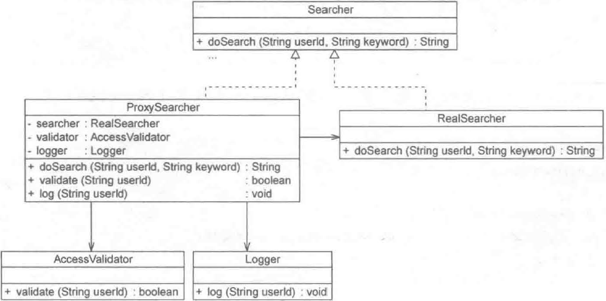

Proxy Pattern: Provide a surrogate or placeholder for another object to control access to it.

代理模式：给某一个对象提供一个代理或占位符，并由代理对象来控制对原对象的访问。

代理模式是一种对象结构型模式。在代理模式中引入了一个新的代理对象，代理对象在客户端对象和目标对象之间起到中介的作用，它去掉客户不能看到的内容和服务或者增添客户需要的额外的新服务。

## 结构

代理模式包含以下 3 个角色：

（1）**Subject**（**抽象主题角色**）：它声明了真实主题和代理主题的共同接口，这样一来在任何使用真实主题的地方都可以使用代理主题，客户端通常需要针对抽象主题角色进行编程。

（2）**Proxy**（**代理主题角色**）：它包含了对真实主题的引用，从而可以在任何时候操作真实主题对象；在代理主题角色中提供了一个与真实主题角色相同的接口，以便在任何时候都可以替代真实主题；代理主题角色还可以控制对真实主题的使用，负责在需要的时候创建和删除真实主题对象，并对真实主题对象的使用加以约束。通常，在代理主题角色中客户端在调用所引用的真实主题操作之前或之后还需要执行其他操作，而不仅仅是单纯调用真实主题对象中的操作。

（3）**RealSubject**（**真实主题角色**）：它定义了代理角色所代表的真实对象，在真实主题角色中实现了真实的业务操作，客户端可以通过代理主题角色间接调用真实主题角色中定义的操作。

## 实现

```java
// 抽象主题类
public abstract class Subject {
  public abstract void request();
}

// 真实主题类
public class RealSubject extends Subject {
  public void request() {
    // 业务方法
  }
}

//代理主题类
public class Proxy extends Subject {
  private RealSubject realSubject;	// 维持对真实主题的引用
  
  public void preRequest() {
    ...
  }
  
  public void postRequest() {
    ...
  }
  
  public void request() {
    preRequest();
    realSubject.request();	// 调用真实主题的业务方法
    postRequest();
  }
}
```

在实际开发过程中，代理类的实现比上述代码要复杂很多，代理模式根据其目的和实现方式不同可分为很多种类，对其中常用的几种代理模式简要说明如下。

- 远程代理（Remote Proxy）：为一个位于不同地址空间的对象提供一个本地的代理对象，这个不同的地址空间可以在同一台主机中，也可以在另一台主机中，远程代理又称为大使 (Ambassador) 。
- 虚拟代理（Vitural Proxy）：如果需要创建一个资源消耗较大的对象，先创建一个消耗相对较小的对象来表示，真实对象只在需要时才会被真正创建。
- 保护代理（Protect Proxy）：控制对一个对象的访问，可以给不同的用户提供不同级别的使用权限。
- 缓冲代理（Cache Proxy）：为某一个目标操作的结果提供临时的存储空间，以便多个客户端可以共享这些结果。
- 智能引用代理（Smart Reference Proxy）：当一个对象被引用时提供一些额外的操作，例如将对象被调用的次数记录下来等。

## 应用实例

某软件公司承接了某信息咨询公司的收费商务信息查询系统的开发任务，该系统的基本需求如下：

（1）在进行商务信息查询之前用户需要通过身份验证，只有合法用户才能够使用该查询系统。

（2）在进行商务信息查询时系统需要记录查询日志，以便根据查询次数收取查询费用。

该软件公司的开发人员已完成了商务信息查询模块的开发任务，现希望能够以一种松耦合的方式向原有系统增加身份验证和日志记录功能，客户端代码可以无区别地对持原始的商务信息查询模块和增加新功能之后的商务信息查询模块，而且可能在将来还要在该信息查询模块中增加一些新的功能。试使用代理模式设计并实现该收费商务信息查询系统。

设计结构图：



## 远程代理

远程代理 (Remote Proxy) 是一种常用的代理模式，它使得客户端程序可以访问在远程主机上的对象。远程代理可以将网络的细节隐藏起来，使得客户端不必考虑网络的存在。

在 Java 语言中可以通过一种名为 RMI (Remote Method Invocation，远程方法调用）的机制来实现远程代理，它能够实现一个 Java 虚拟机中的对象调用另一个 Java 虚拟机中对象的方法。在 RMI 中，客户端对象可以通过一个桩 (Stub) 对象与远程主机上的业务对象进行通信，由于桩对象和远程业务对象接口一致，因此对于客户端而言操作远程对象和本地桩对象没有任何区别，桩对象就是远程业务对象在本地主机的代理对象。

在 RMI 实现的过程中，远程主机端有一个 Skeleton （骨架）对象来负责与 Stub 对象通信，RMI 的基本实现步骤如下：

1. 客户端发起请求，将请求转交至 RMI 客户端的 Stub 类。
2. Stub 类将请求的接口、方法、参数等信息进行序列化。
3. 将序列化后的流使用 Socket 传输至服务器端。
4. 服务器端接收到流后将其转发至相应的 Skeleton 类。
5. Skeleton 类将请求信息反序列化后调用实际的业务处理类。
6. 业务处理类处理完毕后将结果返回给 Skeleton 类。
7. Skeleton 类将结果序列化，再次通过 Socket 将流传送给客户端的 Stub 。
8. Stub 在接收到流后进行反序列化，将反序列化后得到的 Java Object 对象返回给客户端调用者。

至此，一次完整的远程方法调用得以完成。

## 虚拟代理

虚拟代理 (Virtual Proxy) 也是一种常用的代理模式，对于一些占用系统资源较多或者加载时间较长的对象，可以给这些对象提供一个虚拟代理。在真实对象创建成功之前虚拟代理扮演真实对象的替身，而当真实对象创建之后虚拟代理将用户的请求转发给真实对象。

通常在以下两种情况下可以考虑使用虚拟代理：

（1）由于对象本身的复杂性或者网络等原因导致一个对象需要较长的加载时间，此时可以用一个加载时间相对较短的代理对象来代表真实对象。

（2）当一个对象的加载十分耗费系统资源的时候也非常适合使用虚拟代理。虚拟代理可以让那些占用大量内存或处理起来非常复杂的对象推迟到使用它们的时候才创建，而在此之前用一个相对来说占用资源较少的代理对象来代表真实对象，再通过代理对象来引用真实对象。

## Java 动态代理

在传统的代理模式中客户端通过 Proxy 类调用 RealSubject 类的`request()`方法，同时还可以在代理类中封装其他方法（例如`preRequest()`和`postRequest()`等）。如果按照这种方法使用代理模式，那么代理类和真实主题类都应该是事先已经存在的，代理类的接口和所代理方法都巳明确指定。每一个代理类在编译之后都会生成一个 class 文件，代理类所实现的接口和所代理的方法都被固定，这种代理被称为**静态代理** (Static Proxy) 。如果需要为不同的真实主题类提供代理类或者代理一个真实主题类中的不同方法，都需要增加新的代理类，这将导致系统中的类个数急剧增加，因此需要想办法减少系统中类的个数。

动态代理 (Dynamic Proxy) 可以让系统在运行时根据实际需要来动态创建代理类，让同一个代理类能够代理多个不同的真实主题类而且可以代理不同的方法。

从 JDK 1. 3 开始， Java 语言提供了对动态代理的支持，现简要说明如下：

1. **Proxy 类**

Proxy 类提供了用于创建动态代理类和实例对象的方法，它是所创建的动态代理类的父类，它最常用的方法如下。

`public static Class getProxyClass(ClassLoader loader, Class[] interfaces)`：该方法用于返回一个 Class 类型的代理类，在参数中需要提供类加载器并需要指定代理的接口数组（与真实主题类的接口列表一致）。

`public static Object newProxyInstance(ClassLoader loader, Class[] interfaces, InvocationHandler h)`：该方法用于返回一个动态创建的代理类的实例，方法中的第一个参数 loader 表示代理类的类加载器，第二个参数 interfaces 表示代理类所实现的接口列表（与真实主题类的接口列表一致），第三个参数 h 表示所指派的调用处理程序类。

2. **lnvocationHandler 接口**

Invocation Handler 接口是代理处理程序类的实现接口，该接口作为代理实例的调用处理者的公共父类，每一个代理类的实例都可以提供一个相关的具体调用处理者 (lnvocationHandler 接口的子类）。在该接口中声明了如下方法：

`public Object invoke(Object proxy, Method method, Object[] args)`

该方法用于处理对代理类实例的方法调用并返回相应的结果，当一个代理实例中的业务方法被调用时将自动调用该方法。`invoke()`方法包含 3 个参数，其中第一个参数 proxy 表示代理类的实例，第二个参数 method 表示需要代理的方法，第三个参数 args 表示代理方法的参数数组。

动态代理类需要在运行时指定所代理真实主题类的接口，客户端在调用动态代理对象的方法时会将调用请求自动转发给 InvocationHandler 对象的`invoke()`方法，由`invoke()`方法来实现对请求的统一处理。

实例：

某软件公司要为公司 OA 系统数据访问层 DAO 增加方法调用日志，记录每一个方法被调用的时间和调用结果现使用动态代理进行设计和实现。

```java
// 抽象主题角色
public interface UserDao {
  String findById(int id);
}

// 真实主题角色
public class UserDaoImpl implements UserDao {
  @Override
  public String findById(int id) {
    System.out.println("查询中...");
    return "用户 " + id;
  }
}

// 代理主题角色
public class DAOLogHandler implements InvocationHandler {
  private Object object;

  public DAOLogHandler() {}

  // 注入真实主题对象
  public DAOLogHandler(Object o) {
    this.object = o;
  }

  // 调用真实主题类中定义的方法
  @Override
  public Object invoke(Object proxy, Method method, Object[] args) throws Throwable {
    beforeInvoke();
    Object res = method.invoke(object, args);	// 转发调用
    afterInvoke();
    return res;
  }

  public void beforeInvoke() {
    System.out.println(LocalDate.now(ZoneId.of("Asia/Shanghai")));
  }

  public void afterInvoke() {
    System.out.println("方法调用结束");
  }
}

// 客户端
public class Client {
  public void run() {
    UserDao userDao = new UserDaoImpl();
    InvocationHandler h = new DAOLogHandler(userDao);
    UserDao proxy = (UserDao) Proxy.newProxyInstance(UserDao.class.getClassLoader(), new Class[]{UserDao.class}, h);	// 动态创建代理对象
    System.out.println(proxy.findById(1));
  }
}

```

客户端输出结果如下：

```text
2023-05-08
查询中...
方法调用结束
用户 1
```

JDK 中提供的动态代理只能代理一个或多个接口，如果需要动态代理具体类或抽象类，可以使用 CGLib (Code Generation Library) 等工具。

## 优缺点和适用环境

优点：

（1）能够协调调用者和被调用者，在一定程度上降低了系统的耦合度。

（2）客户端可以针对抽象主题角色进行编程，增加和更换代理类无须修改源代码

缺点：

（1）由于在客户端和真实主题之间增加了代理对象，因此有些类型的代理模式可能会造成请求的处理速度变慢，例如保护代理。

适用环境：

（1）当客户端对象需要访问远程主机中的对象时可以使用远程代理。

（2）当需要用一个消耗资源较少的对象来代表一个消耗资源较多的对象，从而降低系统开销、缩短运行时间时可以使用虚拟代理。

（3）当需要为某一个被频繁访问的操作结果提供一个临时存储空间，以供多个客户端共享访问这些结果时可以使用缓冲代理。通过使用缓冲代理，系统无须在客户端每一次访问时都重新执行操作，只需直接从临时缓冲区获取操作结果即可。

（4）当需要控制对一个对象的访问为不同用户提供不同级别的访问权限时可以使用保护代理。

（5）当需要为一个对象的访问（引用）提供一些额外的操作时可以使用智能引用代理。

## 参考

《Java 设计模式》．刘伟．清华大学出版社
