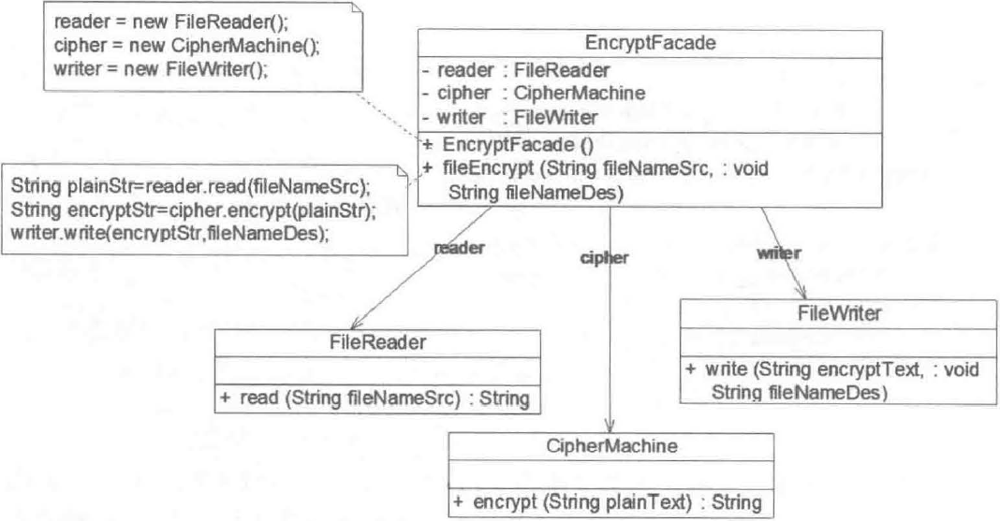
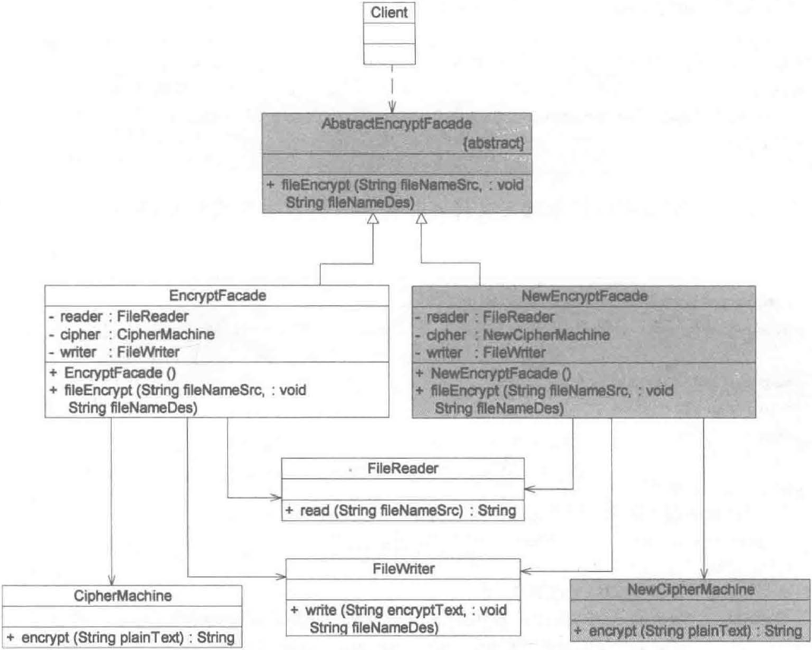

Facade Pattern: Provide a unified interface to a set of interfaces in a subsystem. Facade defines a higher-level interface that makes the subsystem easier to use.

外观模式：为子系统中的一组接口提供一个统一的入口。外观模式定义了一个高层接口， 这个接口使得这一子系统更加容易使用。

外观模式又称为门面模式，它是一种对象结构型模式。在外观模式中，一个子系统的外部与其内部的通信通过一个统一的外观类进行，外观类将客户类与子系统的内部复杂性分隔开，使得客户类只需要与外观角色打交道，而不需要与子系统内部的很多对象打交道。

## 结构

外观模式包含 2 个角色：

（1）**Facade**（**外观角色**）：在客户端可以调用它的方法，在外观角色中可以知道相关的（一个或者多个）子系统的功能和责任；在正常情况下它将所有从客户端发来的请求委派到相应的子系统，传递给相应的子系统对象处理。

（2）**SubSystem**（**子系统角色**）：在软件系统中可以有一个或者多个子系统角色，每一个子系统可以不是一个单独的类，而是一个类的集合； 每一个子系统都可以被客户端直接调用，或者被外观角色调用；子系统并不知道外观的存在，对于子系统而言，外观角色仅仅是另外一个客户端而已。

## 实现

外观模式中所指的子系统是一个广义的概念，它可以是一个类、一个功能模块、系统的一个组成部分或者一个完整的系统。子系统类通常是一些业务类，实现了一些具体的、独立的业务功能。

```java
public class SubSystemA {
  public void methodA(){
    // 业务实现
  }
}
public class SubSystemB {
  public void methodB(){
    // 业务实现
  }
}
public class SubSystemC {
  public void methodC(){
    // 业务实现
  }
}
```

外观角色：

```java
public class Facade {
  public SubSystemA A = new SubSystemA();
  public SubSystemB B = new SubSystemB();
  public SubSystemC C = new SubSystemC();
  
  public void method() {
    A.methodA();
    B.methodB();
    C.methodC();
  }
}
```

客户端：

```java
public class Client {
  public static void main(String args[]) {
    Facade facade = new Facade();
    facade.methon();
  }
}
```

## 实例

某软件公司要开发一个可应用于多个软件的文件加密模块，该模块可以对文件中的数据进行加密并将加密之后的数据存储在一个新文件中，具体的流程包括 3 个部分，分别是读取源文件、加密、保存加密之后的文件，其中读取文件和保存文件使用流来实现，加密操作通过求模运算实现。这 3 个操作相对独立，为了实现代码的独立重用，让设计更符合单一职责原则，这 3 个操作的业务代码封装在 3 个不同的类中。现使用外观模式设计该文件加密模块。

实现结构图如下：



## 抽象外观类

在标准的外观模式结构图中，如果需要增加、删除或更换与外观类交互的子系统类，必须修改外观类或客户端的源代码，这将违背开闭原则，因此可以通过引入抽象外观类对系统进行改进，这在一定程度上可以解决该问题。

例如：在应用实例 “文件加密模块“ 中更换一个加密类，不再使用原有的基于求模运算的加密类 CipherMachine，而改为基于移位运算的新加密类 NewCipherMachine。在不修改原有外观类的情况下，通过添加新的外观抽象类来实现对子系统对象引用的改变。



## 优缺点与适用环境

优点：

（1）它对客户端屏蔽了子系统组件，减少了客户端所需处理的对象数目。

（2）它实现了子系统与客户端之间的松耦合关系，这使得子系统的变化不会影响到调用它的客户端，只需要调整外观类即可。

（3）一个子系统的修改对其他子系统没有任何影响，而且子系统内部变化也不会影响到外观对象。

缺点：

（1）不能很好地限制客户端直接使用子系统类，如果对客户端访问子系统类做太多的限制则减少了可变性和灵活性。

适用环境：

（1）当要为访问一系列复杂的子系统提供一个简单入口时可以使用外观模式。

（2）客户端程序与多个子系统之间存在很大的依赖性。

（3）在层次化结构中可以使用外观模式定义系统中每一层的入口，层与层之间不直接产生联系，而通过外观类建立联系，降低层之间的耦合度。

## 参考

《Java 设计模式》．刘伟．清华大学出版社
