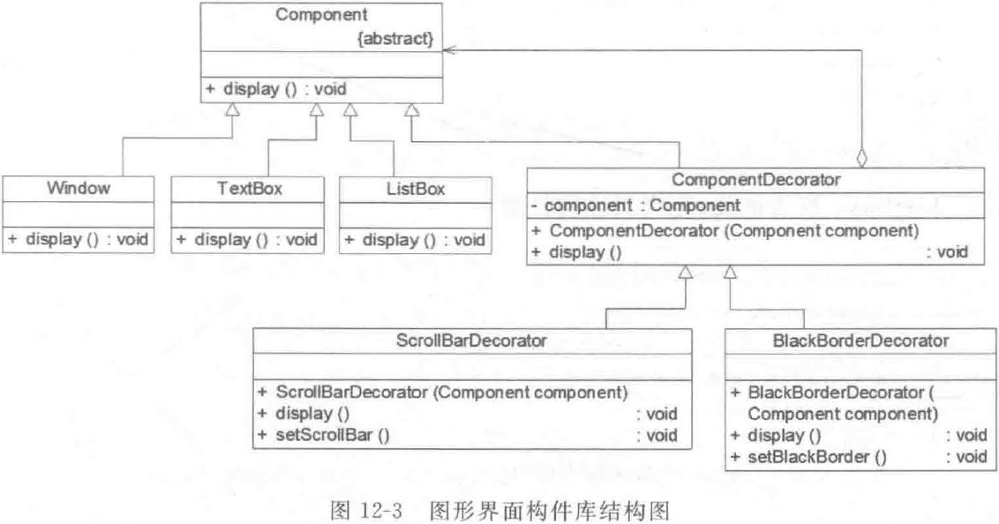

Decorator Pattern: Attach additional resposibilies to an object dynamically. Decorators provide a flexible alternative to subclassing for exlending functionality.

装饰模式：动态地给一个对象增加一些额外的职责。就扩展功能而言，装饰模式提供了一种比使用子类更加灵活的替代方案。

装饰模式是一种对象结构型模式， 它以对客户透明的方式动态地给一个对象附加上更多的责任，可以在不需要创建更多子类的情况下让对象的功能得以扩展。

## 结构

装饰模式包含以下 4 个角色：

（1）**Component**（**抽象构件**）：它是具体构件和抽象装饰类的共同父类，声明了在具体构件中实现的业务方法，它的引入可以使客户端以一致的方式处理未被装饰的对象以及装饰之后的对象，实现客户端的透明操作。

（2）**ConcreteComponent**（**具体构件**）：它是抽象构件类的子类，用于定义具体的构件对象，实现了在抽象构件中声明的方法，装饰类可以给它增加额外的职责（方法） 。

（3）**Decorator**（**抽象装饰类**）：它也是抽象构件类的子类，用于给具体构件增加职责． 但是具体职责在其子类中实现。它维护一个指向抽象构件对象的引用，通过该引用可以调用装饰之前构件对象的方法，并通过其子类扩展该方法，以达到装饰的目的。

（4）**ConcreteDecorator**（**具体装饰类**）：它是抽象装饰类的子类，负责向构件添加新的职责。每一个具体装饰类都定义了一些新的行为．它可以调用在抽象装饰类中定义的方法， 并可以增加新的方法用千扩充对象的行为。

## 实现

抽象构件类一般设计为抽象类或者接口，在其中声明了抽象业务方法，当然也可以在抽象构件类中实现一些所有具体构件类都共有的业务方法。

```java
// 抽象构件
public abstract class Component {
  public abstract void operation();
}


// 具体构件
public class ConcreteComponent extends Component {
  public void operation() {
    // 基本功能实现
  }
}
```


```java
// 抽象装饰类
public class Decorator extends Component {
  private Component c;	// 维持一个对抽象构件对象的引用
  
  public Decorator(Component c) {
    this.c = c;
  }
  
  public void operation() {
    c.operation();	// 调用原有业务方法
  }
}
```

注意：在 Decorator 中并未真正实现`operation()`方法只是调用原有 component 对象的`operation()`方法，它没有真正实施装饰，而是提供一个统一的接口，将具体装饰过程交给子类完成。

```java
// 具体装饰类
public class ConcreteDecorator extends Decorator {
  
  public ConcreteDecorator(Component c) {
    super(c);
  }
  
  public void operation() {
    super.operation();	// 调用原有业务方法
    addedBehavior();		// 调用新增业务方法
  }
  
  // 新增业务方法
  public void addedBehavior() {
    ...
  }
}
```

在具体装饰类中可以调用到抽象装饰类的`operation`方法，同时可以定义新的业务方法，例如`addedBehavior()`。如果不希望该方法被客户端单独调用，可以将其可见性设为私有。

## 实例

某软件公司基于面向对象技术开发了一套图形界面构件库 VisualComponent，该构件库提供了大量的基本构件，如窗体、文本框、列表框等，由于在使用该构件库时用户经常要求定制一些特殊的显示效果，如带滚动条的窗体、带黑色边框的文本框、既带滚动条又带黑色边框的列表框等，因此经常需要对该构件库进行扩展以增强其功能。现使用装饰模式来设计该图形界面构件库。

实现结构图如下：



## 透明装饰模式和半透明装饰模式

在标准的装饰模式中新增行为需在原有业务方法中调用，无论是具体构件对象还是装饰过的构件对象，对于客户端而言都是透明的，这种装饰模式被称为透明 (Transparent) 装饰模式。但是在某些情况下，有些新增行为可能需要单独被调用，此时客户端不能再一致性地处理装饰之前的对象和装饰之后的对象，这种装饰模式被称为半透明(Semi-transparent) 装饰模式。

### 透明装饰模式

在透明装饰模式中要求客户端完全针对抽象编程，装饰模式的透明性要求客户端程序不应该将对象声明为具体构件类型或具体装饰类型，而应该全部声明为抽象构件类型。对于客户端而言，具体构件对象和具体装饰对象没有任何区别。

```java
Component c1, c2;	// 使用抽象构件类型定义对象
c1 = new ConcreteComponent();
c2 = new ConcreteDecorator(c1);
c2.operation();
```

透明装饰模式可以让客户端透明地使用装饰之前的对象和装饰之后的对象，无须关心它们的区别，此外还可以对一个已装饰过的对象进行多次装饰。

## 半透明装饰模式

为了能够调用新增方法，不得不用具体装饰类型来定义装饰之后的对象，而具体构件类型仍然可以使
用抽象构件类型来定义，这种装饰模式即为半透明装饰模式。

```java
Component c1 = new ConcreteComponent();	// 具体构件可以用抽象构件类型
ConcreteDecorator c2 = new ConcreteDecorator(c1);	// 必须用具体装饰类型声明
c2.addedBehavior();	// 单独调用新增业务方法
```

半透明装饰模式可以给系统带来更多的灵活性，设计相对简单，使用起来也非常方便；但是其最大的缺点在于不能实现对同一个对象的多次装饰，而且客户端需要有区别地对待装饰之前的对象和装饰之后的对象。

## 优缺点和适用环境

优点：

（1）对于扩展一个对象的功能，装饰模式比继承更加灵活．不会导致类的个数急剧增加。

（2）可以通过一种动态的方式来扩展一个对象的功能，通过配置文件可以在运行时选择不同的具体装饰类，从而实现不同的行为。

（3）可以对一个对象进行多次装饰。

（4）具体构件类与具体装饰类可以独立变化，用户可以根据需要增加新的具体构件类和具体装饰类，原有类库代码无须改变，符合开闭原则。

缺点：

（1）在使用装饰模式进行系统设计时将产生很多小对象，这些对象的区别在于它们之间相互连接的方式有所不同，而不是它们的类或者属性值有所不同，大量小对象的产生势必会占用更多的系统资源，在一定程度上影响程序的性能。

（2）更易出错，排错也更困难。

适用环境：

（1）在不影响其他对象的情况下以动态、透明的方式给单个对象添加职责。

（2）当不能采用继承的方式对系统进行扩展或者采用继承不利于系统扩展和维护时可以使用装饰模式。不能采用继承的情况主要有两类：第一类是系统中存在大量独立的扩展，为支持每一种扩展或者扩展之间的组合将产生大量的子类．使得子类数目呈爆炸性增长；第二类是因为类被定义为不能被继承。
